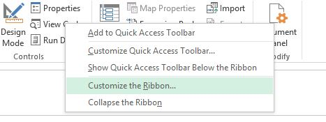
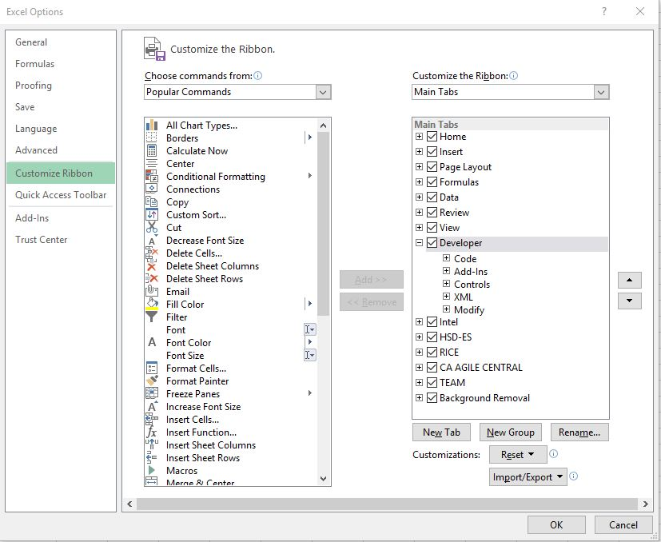

# Getting Started with VBA Macro

* *Right click ribbon*  
    click on Customize the Ribbon  
     
* check developer checkbox in main  
    
* go to developer and click  “view code” to see/write codes
    * link to learn more: [macro for beginners](https://powerspreadsheets.com/excel-macro-tutorial-for-beginners/)

